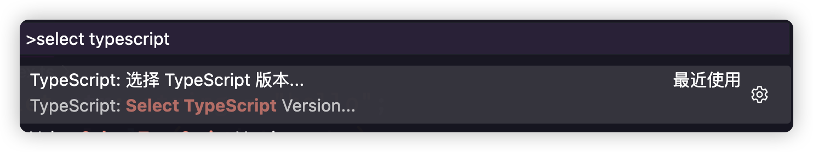
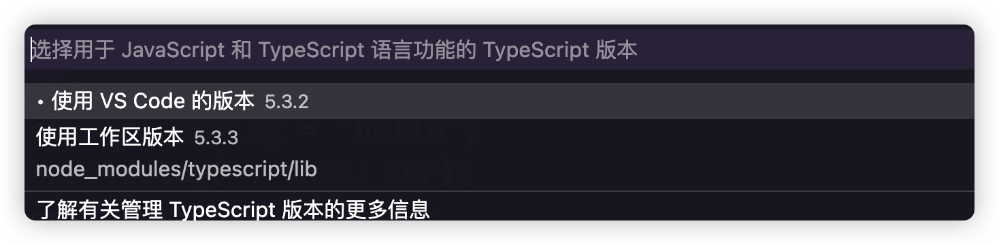
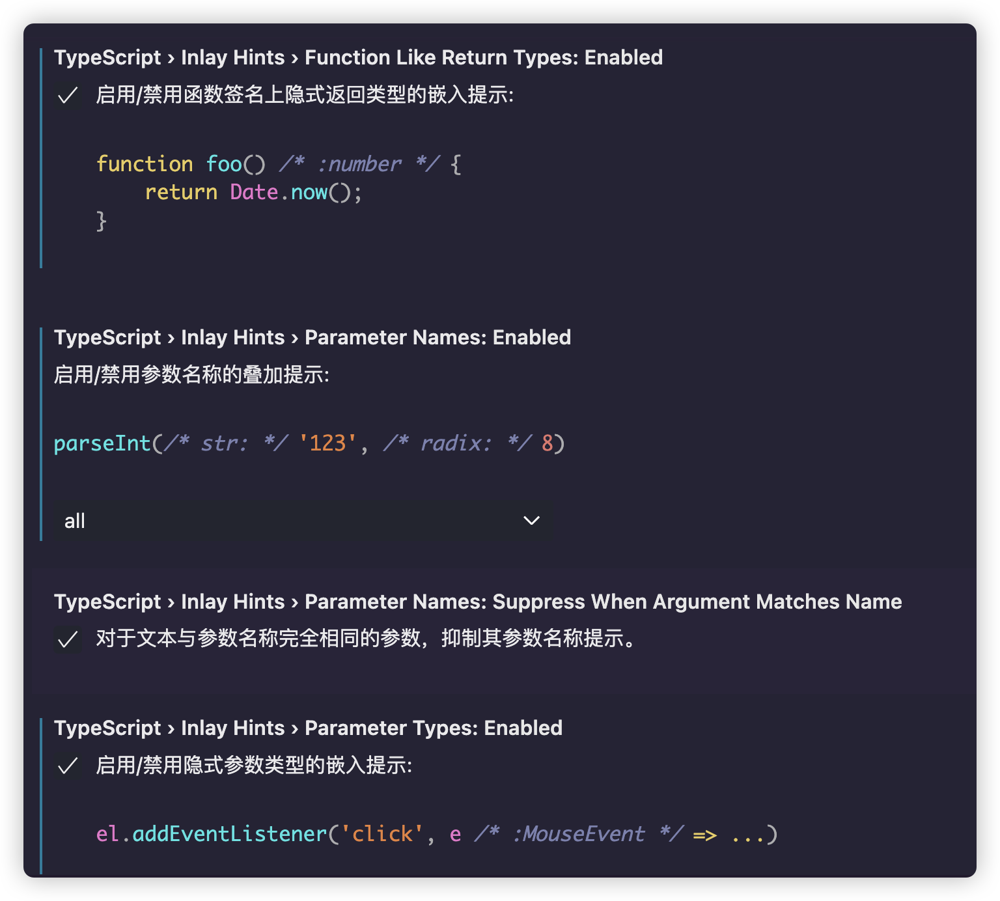
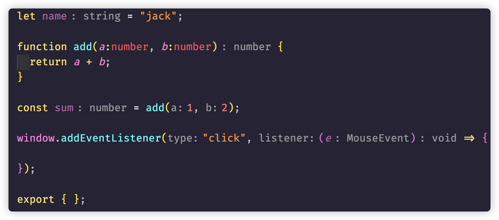
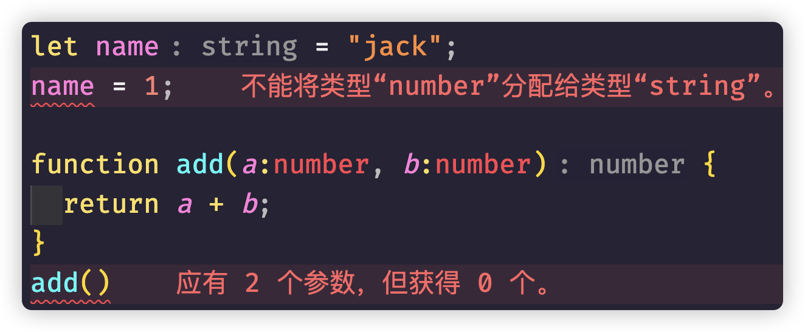

## tsconfig初始化

```shell
tsc --init
```

## 工程切换Typescript

如果本地工程中也安装了typescript，并且希望相关类型引用指向本地typescript，而不是vscode内置的typescript，可以自行进行切换

 `Ctrl` (`Command` 在 macOS) + `Shift` + `P`  打开**命令面板**，输入`Select Typescript Version`，选择切换即可





## 开发相关设置

在**「设置」**中，**「打开工作区设置」**，由于内容较多，可以使用搜索词：**typescript inlay hints**

对于新手，推荐开启的配置项主要是这几个：

- Function Like Return Types，显示推导得到的函数返回值类型；
- Parameter Names，显示函数入参的名称；
- Parameter Types，显示函数入参的类型；
- Variable Types，显示变量的类型。



```javascript
{
  "typescript.inlayHints.functionLikeReturnTypes.enabled": true,
  "typescript.inlayHints.parameterNames.enabled": "all",
  "typescript.inlayHints.parameterTypes.enabled": true,
  "typescript.inlayHints.variableTypes.enabled": true
}

```



> 当然，并不是所有人都习惯这样的显示方式，你可以根据自己的需要进行调整。

## VS Code插件

**Error Lens：**这个插件能够把错误直接显示到代码文件中的对应位置：



